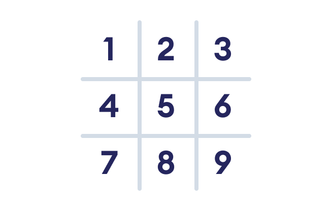

# Project Introduction
In this project, we will create a tic-tac-toe game in Python.

# How is tic-tac-toe played?
- The game is played between two players on a grid that's 3 squares by 3 squares. 
- If a player decides to select X, the other player will take O. Players take turns putting their marks in empty squares. 
- The first player to get 3 of their marks in a straight row wins. 
- If all the 9 squares are full but none of the players can get 3 of their marks in a row, it's a draw. 
- Next, we will focus on how we will create this project.

# Project Design
There are mainly three aspects to this game:

- The tic-tac-toe Board 
- Two Players 
- Win and Draw Logic 

**The tic-tac-toe Board**

Since a tic-tac-toe board contains 9 squares, we will use a list of 9 items to handle this task. And, we will use the position number to identify a grid. For example, **position 8** means bottom middle grid.

Figure: Position of Grids
Two Players

As we have said, this game is played between two players.

In our game, the first player will always get the X symbol and the second player will always get the O symbol.

**Win and Draw Logic**

We will check the position of symbols in a list for win/draw logic. For example,

- if position 4, 5 and 6 have the same X symbol, the first player won the game 
- if position 3, 5 and 7 have the same O symbol, the second player won the game 
- if position 2, 5 and 8 have the same X symbol, the first player won the game and so on.

If all the positions are filled but none of the players gets 3 of their symbols in a row, it's a draw.

# Implementing Tic-tac-toe in Python
We will use object-oriented programming to create this game. Our game will have three classes:

- Board - to handle the tic-tac-toe board and handle winning/draw logic 
- Player - to handle the name of players and symbols they are using 
- Game - to handle the game logic
Before we begin to write code, there are a few things we need to understand when working with multiple classes, which we will explore next.

